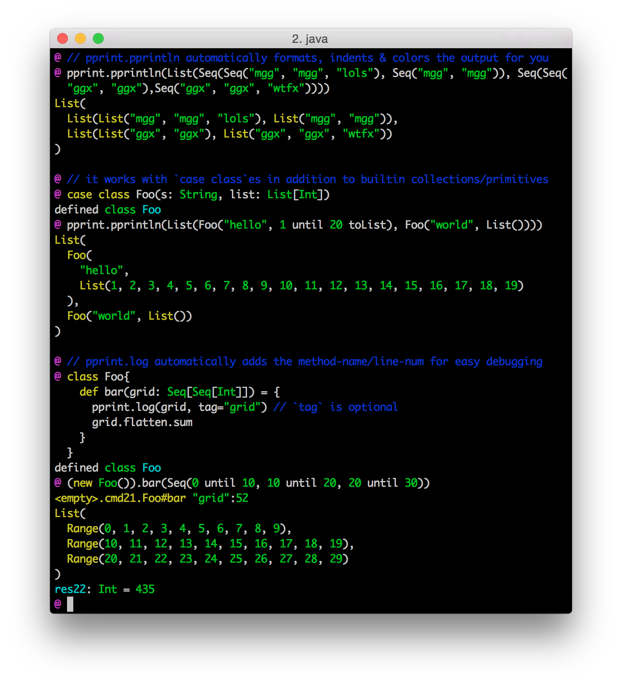

[[pprint|../pprint.html]] is a module that lets you easily print data structures in a form that is more convenient to use both visually and programmatically.

Unlike a traditional `.toString()`, PPrint...

Prints many common data structures in a source-code-compatible way (e.g. strings are escaped), that you can paste directly into a console or REPL to evaluate
Things are laid out nicely! Vertically spaced out and properly indented, instead of being all squashed onto one line.

Pretty-printed output can be colored for easy viewing!
Pretty-printing is streaming, meaning you can pretty-print extremely large data structures and stream it to stdout/files/logging without having to materialize the whole string in memory.

Pretty-printing is configurable, so you can configure maximum widths for wrapping, maximum heights for truncation, and other such things.

If you've enjoyed using PPrint or any of my other libraries, please consider [chipping in](https://www.patreon.com/lihaoyi) to support their ongoing development on Patreon! Any amount helps ensure we can continue improving these libraries going forward.