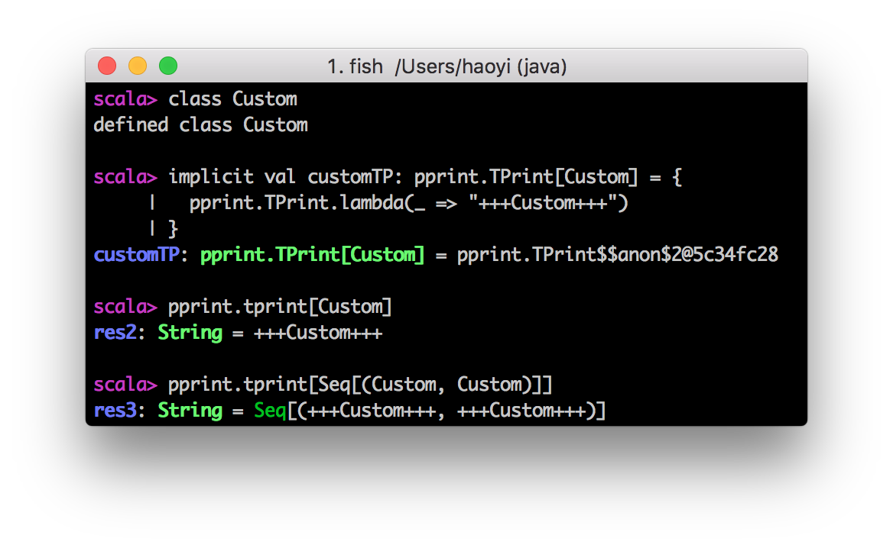

PPrint also allows you to pretty-print types with the pprint.tprint function:


Apart from calling `tprint` yourself, you can also add an implicit `TPrint[T]` param to a function with a type-parameter `T`` and use `TPrint[T]#render(cfg: Config)` to pretty-print a type. This is handy if you want to write type-printing functionality to an existing function.

Like value pretty-printing, the colors can be configured by the `pprint.Config`, with `import pprint.Config.Colors._` for colored type-printing and `import pprint.Config.BlackWhite._` for non-colored type-printing. You can also provide your own implicit `TPrint[T]` values if you want to customize the type printing of a particular type.



```scala mdoc
